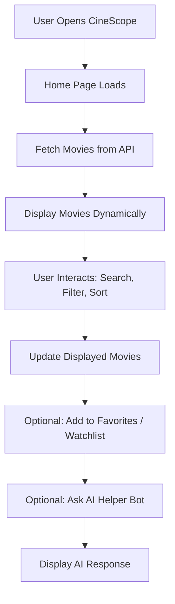

#CineScope

# CineScope

## Project Description
CineScope is a modern web application that allows users to discover movies and TV shows dynamically. It fetches real-time data from a public API and provides searching, filtering, and sorting capabilities. Users can save favorites in local storage and optionally interact with an AI-powered helper bot to explore features or get movie recommendations.

## Features

### Core Features
- Real-time movie data fetching via API.
- Search movies by title or keyword (using JS higher-order functions: `map`, `filter`, `sort`).
- Filter movies by genre, year, or rating.
- Sort movies alphabetically or by rating.
- Save favorites/watchlist with local storage.
- Dark mode / Light mode toggle.
- Loading indicators during API calls.
- Fully responsive UI.

### Optional AI Features
- Chatbot providing recommendations and answering queries.
- Supports interactive guidance for new users.

## Technologies Used
- HTML, CSS, JavaScript (ES6+)
- Public Movie API (OMDB or TMDB)
- Local Storage
- Optional AI API integration (OpenAI or similar)
- Optional Supabase/Firebase for backend persistence

## Project Workflow

### 1. User Flow


## Setup Instructions

1. **Clone the repository:**
```bash
git clone https://github.com/HardikWahi07/CineScope
```

2. **Open the project:**
- Open `index.html` in a web browser.

3. **Optional: AI Helper Bot**
- Add your AI API key in `config.js` to enable the helper bot.

4. **Optional: Backend Storage**
- Configure Supabase or Firebase if you want to store user data or watchlists on the backend.

## Usage

- Use the search bar to find movies by title.
- Apply filters to narrow down by genre, year, or rating.
- Sort movies alphabetically or by rating.
- Click movie cards to add movies to favorites or watchlist.
- Interact with the AI helper bot for guidance and recommendations.

## Best Practices Followed

- Modular, reusable code structure.
- Dynamic updates using JavaScript higher-order functions (`map`, `filter`, `sort`).
- Error handling for API calls.
- Responsive design for all devices (mobile, tablet, desktop).
- Persistent favorites/watchlist using local storage.

## Future Enhancements

- Pagination or infinite scroll for large datasets.
- Advanced AI-based movie recommendation engine.
- User authentication with synced watchlists across devices.
